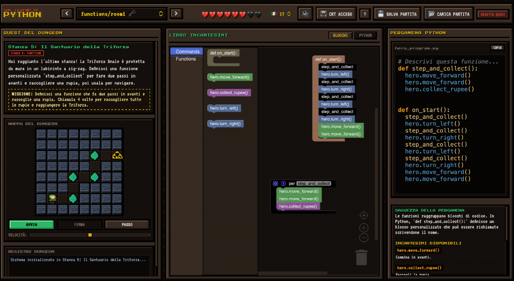

# The Legend of Python



**The Legend of Python** is an educational, browser-based retro programming game designed to teach Python and programming logic using a visual, gamified environment inspired by retro Zelda classics. 

Players guide the hero, **Link**, through grid-based stone dungeons to reach the gold **Triforce Warp Gate**, using either visual **Blockly** blocks or writing raw **Python** code.

---

## 🎮 Game Interface & Layout

The application features a dark, 8-bit retro theme with harmonic HSL colors and includes:
- **Interactive Simulator**: A real-time canvas where Link performs movements, collects rupees, detects obstacles, or crashes into walls.
- **Dungeon Console Registry**: A terminal logging actions, game statuses, console prints, and warnings or compilation errors.
- **Spell Book & Code Editor**:
  - **Blocks Mode**: A Blockly workspace containing category drawers (Commands, Variables, Loops, Logic, Functions) to build visual code structures.
  - **Python Mode**: A syntax-highlighted text editor showing the compiled code and allowing advanced players to write Python statements directly.

---

## ⚡ Core Features

### 1. Dual Programming Workspace & Synchronization
Players can toggle seamlessly between a visual **Blockly** editor and a text-based **Python** editor. Changes in Blockly automatically translate to real-time Python code, bridging the gap between block-based and text-based syntax. When transitioning to the Python tab, code is automatically synced; manual edits in the Python code-area lock it to prevent accidental overwriting unless cleared.

### 2. Event-Driven Execution (`on_start`)
To align with standard programming conventions, code must be placed inside the `on_start()` function context:
- In Blockly: Blocks must attach to the `Quando premi avvia` / `on_start` event block.
- In Python: Code must be wrapped inside a `def on_start():` function definition.
- **Visual Disabling**: Blocks placed outside the event block are dynamically greyed out and ignored.
- **Singleton Constraints**: Blockly restricts the workspace to exactly **one** `on_start` block using `maxInstances` configurations.

### 3. Programming Construct Enforcement
To prevent players from bypassing the learning objectives (e.g. writing repeating sequential lines of code instead of a loop), the compiler enforces conceptual requirements before execution:
- **Conditionals Room**: Requires at least one `if` statement block/construct.
- **Loops Room**: Requires at least one `for` or `while` loop construct.
- **Functions Room**: Requires at least one custom function declaration (`def`).
- *Note:* In Python mode, comments are automatically stripped during validation to prevent cheating (e.g., `# using a for loop` will not bypass the check).

### 4. Interactive Step-by-Step Debugger & Active Highlighting
In addition to the **Run (AVVIA)** button, players can use the **Step (PASSO)** debugger to execute commands one-by-one. The simulator advances Link step-by-step and inspects console outputs without resetting his position between steps.
During execution, the active Blockly block glows with a golden outline on the canvas, or the active statement line is highlighted with a gold retro bar in the Python code editor gutter and Python Scroll pane.

### 5. WebAssembly Python Sandbox (Pyodide) & Dynamic Modules
Advanced rooms (like the Enigma level) are executed client-side using a sandboxed WebAssembly **Pyodide** environment. If the challenge requires custom external libraries (e.g., `enigmapython`), the engine dynamically installs them using `micropip` and invalidates Python's import caches via `importlib.invalidate_caches()` to make them immediately importable.

### 6. Expert Mode (Python-Only)
Players can toggle "Expert Mode" (via the 🧠 button in the header) which hides the visual Blockly workspace entirely, forcing the player to code solely in Python text. The preference persists in local storage.

### 7. Space-Saving Iconized Controls & Dynamic Titles
- **Header Controls**: Switched to square, emoji-based icon buttons (🔊, 📺, 🧠, ?, 💾, 📂, 🔄) to prevent layout overflows. Tooltips are localized and dynamically updated with state info, such as `(ON)` / `(OFF)`.
- **Dynamic Box Header**: The left panel header dynamically loads the current level's title (e.g., `"LA LENTE DELLA VERITÀ"`) from `room.js` with full translation support, replacing generic labels.

### 8. Retro Sound Synthesizer (`RetroSynth`)
Built using the browser's Web Audio API, a custom synthesizer generates authentic 8-bit sound effects (chimes, clicks, rupee collections, step movements, victory fanfares, and error blips) without loading external audio assets. An interaction unlock listener automatically initializes the AudioContext on the first user click/keypress to comply with browser autoplay restrictions.

### 9. i18n Translation Engine
The interface includes full localization support for English (**EN**) and Italian (**IT**). Story dialogs, objectives, command documentation, help menus, console logs, and Blockly block labels translate dynamically.

### 10. Room Presets & Dropdown Selection Filter
A dedicated preset selector dropdown next to the room select dropdown allows filtering visible rooms by curated groups:
- **Presets**: Curated categories like *All Levels* (special wildcard), *Basic Level*, *Intermediate Level*, and *Advanced Level* mapped to explicit lists of room IDs inside `js/levels.js`.
- **Auto-Correction**: Switching presets immediately corrects the selected level to the first room of the newly chosen preset if the currently active level is not included in it.
- **Navigation Traversal Limits**: Cycles strictly within the active preset's rooms when clicking prev/next arrows or using success modal links.

---

## 🗂️ Curriculum & Room Progression

Levels are organized in the selection dropdown under difficulty groupings:

### 🟢 Basic Level (Livello Base)
- **Sequences room 1: The Hero's Awakening** (`sequences/room1`) - Linear instructions (`hero.move_forward()`).
- **Variables room 1: The Rupee Caves** (`variables/room1`) - Declaring, incrementing variables (`rupees = rupees + 1`), and outputting results (`print(rupees)`).
- **Conditionals room 1: Eye of Truth** (`conditionals/room1`) - Checking environment tiles using sensors (`if hero.scan_ahead() == "obstacle":`).
- **Loops room 1: The Rupee Vault** (`loops/room1`) - Repeating routines cleanly (`for i in range(4):`).
- **Functions room 1: The Triforce Chamber** (`functions/room1`) - Defining custom macros (`def step_and_collect():`) to navigate mazes.

### 🟡 Intermediate Level (Livello Intermedio)
- **Lists room 1: Path of Crystals** (`lists/room1`) - Using array structures to store coordinates or move queues.
- **Objects room 1: Enigma and Objects** (`objects/room1`) - Emulating historical Enigma M3 cryptographic hardware by configuring swappable plugboards, rotors, reflectors, and entry wheels using object instantiation.

### 🔴 Advanced Level (Livello Avanzato)
- **Recursion room 1: Recursive Maze** (`recursion/room1`) - Using recursive calls to solve winding portals and nested chambers.

---

## 💖 Topic-Based Hearts Progress & Save System

- **Hearts Display**: The HUD displays a list of hearts representing the educational topics (concepts) present in the **currently selected preset**. The hearts bar dynamically sizes to match the number of sections included in the active preset. A heart turns red (`❤️`) only when all rooms under that specific concept *within the preset* are cleared, promoting complete topic mastery.
- **Auto-Save**: Progress and custom workspace layouts auto-save to browser `localStorage` on level load and win.
- **JSON Save Import/Export**: Players can download their game states (`.json` files) and load them on other machines.
- **Backward-Compatible Migration**: The system features an automatic migration helper (`migrateOldSaveData`). If it detects a legacy save utilizing old numeric IDs (`1` to `7`), it silently maps them to the new folder-based namespaces (e.g. `conditionals/room1`), ensuring players keep their progress across updates.

---

## 📂 Project Modularity & Directory Structure

The codebase is organized modularly to ease maintainability and scaling:
```
├── index.html          # Game Dashboard layout and script dependencies
├── style.css           # Vanilla HSL retro stylesheet & layout styling
├── js/
│   ├── app.js          # Core controller, event bindings, and Synth engine
│   ├── blocks.js       # Custom Blockly definitions & JS/Python generators
│   ├── i18n.js         # Translation dictionaries (IT/EN) and helper
│   ├── simulator.js    # Simulation canvas renderer & action queue evaluator
│   ├── levels.js       # Levels dynamic aggregator & environment check
│   └── rooms/          # Topic-based room configuration files
│       ├── sequences/
│       │   └── room1.js
│       ├── variables/
│       │   └── room1.js
│       ├── conditionals/
│       │   └── room1.js
│       ├── loops/
│       │   └── room1.js
│       ├── functions/
│       │   └── room1.js
│       ├── lists/
│       │   └── room1.js
│       └── recursion/
│           └── room1.js
└── tests/
    ├── rooms.test.js   # Automated room schema and pathfinding test suite
    └── dom.test.js     # DOM user standpoint and interactive UI test suite
```

---

## 💻 How to Run & Verify

### 1. Launch the Application Locally
Run a basic HTTP server in the project directory:
```bash
python3 -m http.server 8000
```
Open your browser and navigate to `http://localhost:8000`.

### 2. Run Automated Test Suites
We provide a comprehensive Node.js unit and integration test suite. Run:
```bash
npm test
```
The tests are split into two sequential suites:

#### A. Room Schema & Pathfinding (`tests/rooms.test.js`)
- **Schema Conformity**: Checks types and translation coverage for all levels.
- **Bounds Checking**: Assures start coordinates, sizes, and tiles are valid.
- **BFS Pathfinding Solvability**: Runs a Breadth-First Search to programmatically prove a path exists from the hero's start to the Triforce portal without crossing walls.
- **Crystals/Rupee Reachability**: Confirms all crystals placed on the map are fully reachable from the starting point and match the configured target crystals.

#### B. User Standpoint DOM Interactions (`tests/dom.test.js`)
- **Headless Browser Simulation**: Uses `jsdom` to spin up the HTML document and load local scripts in a simulated DOM context.
- **Component Mocking**: Implements mock overrides for Blockly, Web Audio, Canvas API, and animation frames (`requestAnimationFrame`).
- **Interactive Workflows**: Verifies selector dropdown filtering, out-of-bound level auto-corrections, language translation updates, sound toggler storage persistence, preset boundaries traversal navigation, and completion state HUD updates.
